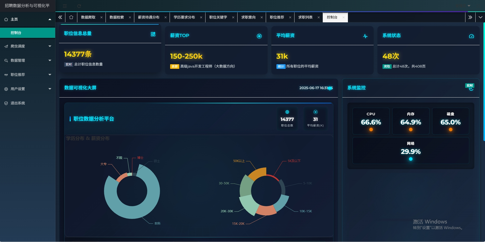
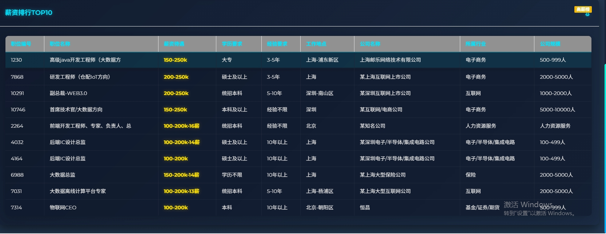
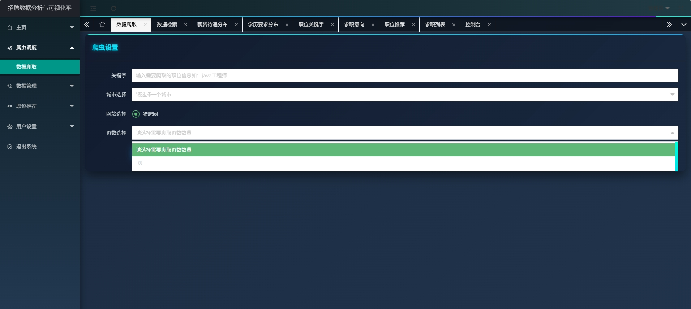
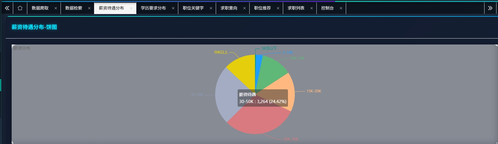
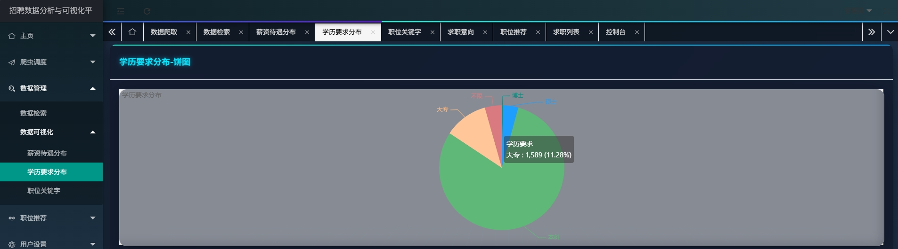
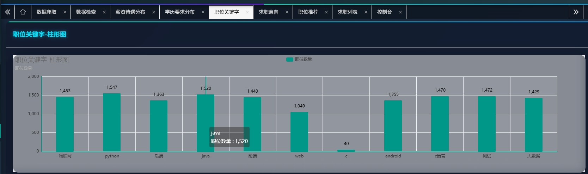
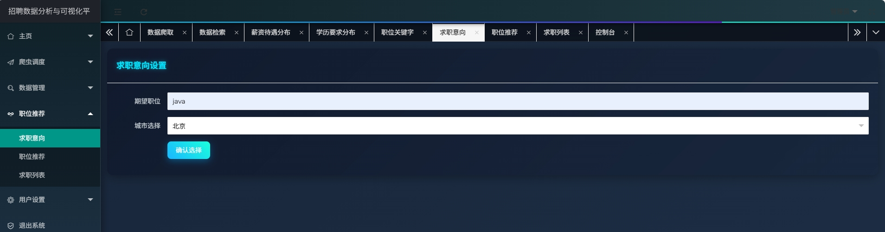
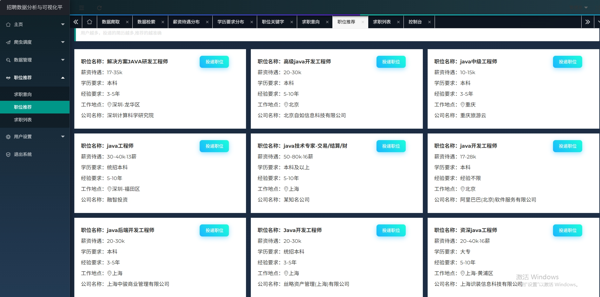
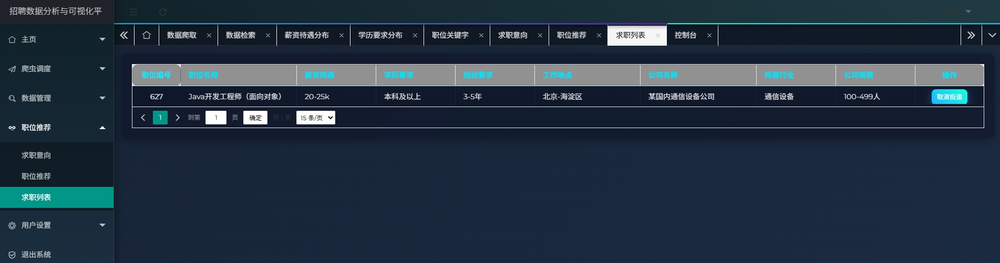
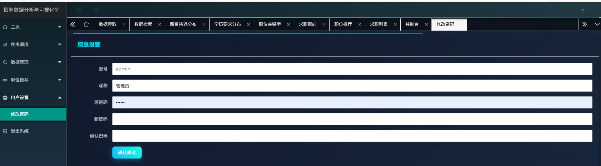

# 基于python的招聘数据分析与可视化平台（爬虫可视化分析）

## 项目功能分析

1. **用户系统**：
   - 用户注册、登录、登出
   - 个人信息管理和修改

2. **招聘信息展示**：
   - 职位列表展示
   - 职位详情查看
   - 筛选和搜索功能
3. **职位推荐系统**：
   - 基于物品的协同过滤推荐算法
   - 根据用户投递历史和职位意向进行个性化推荐
4. **数据可视化分析**：
   - 薪资统计分析（饼图）
   - 教育水平分析（条形图）
   - 数据看板和统计信息
5. **简历投递管理**：
   - 职位投递功能
   - 已投递列表管理
   - 投递状态跟踪
6. **爬虫系统**：
   - 集成了招聘信息爬虫
   - 爬虫状态监控和管理界面
7. **后台管理系统**：
   - 使用SimpleUI美化的Django admin管理界面
   - 招聘信息和用户管理
     
## 运行效果展示
1.可视化大屏展示

2.薪资排行分析

3.数据爬虫（部分招聘已经做反爬机制）

4.可视化图形分析

5.求职意向，求职推荐，求职列表

6.个人信息修改

7登录注册

## 技术栈

1. **后端框架**：
   - Django 3.2.8（Python Web框架）
   - MySQL（数据库）
   - PyMySQL（MySQL驱动）

2. **前端技术**：
   - Layui（前端UI框架）
   - HTML/CSS/JavaScript
   - 模板系统（Django模板）

3. **数据处理与分析**：
   - 协同过滤推荐算法
   - NumPy（数据处理）
4. **爬虫技术**：
   - Selenium（用于动态网页爬取）
   - Chrome驱动（chromedriver.exe）
5. **系统监控**：
   - psutil（系统资源监控）
6. **可视化技术**：
   - 图表可视化（可能使用ECharts或其他JS图表库）
## 部署环境
1. **开发环境**：
   - Python 3.9.10.11
   - Windows系统（基于文件路径判断）
   - 虚拟环境（venv）

2. **服务器要求**：
   - 支持Python和Django的Web服务器
   - MySQL数据库服务
   - 设置允许了调试模式（DEBUG = True），说明可能仍处于开发阶段

3. **部署配置**：
   - 项目设置了中文界面（LANGUAGE_CODE = 'zh-hans'）
   - 时区设置为亚洲/上海（TIME_ZONE = 'Asia/Shanghai'）
   - 静态文件配置完善，可直接部署

## 系统特色

1. **个性化推荐**：采用协同过滤算法，根据用户行为和意向进行职位推荐

2. **数据可视化**：提供多种数据统计图表，帮助用户分析就业市场情况

3. **爬虫集成**：自动化爬取招聘信息，保持数据更新

4. **美化的管理界面**：使用SimpleUI优化了Django admin界面

5. **响应式设计**：前端采用现代UI框架，支持多设备访问
